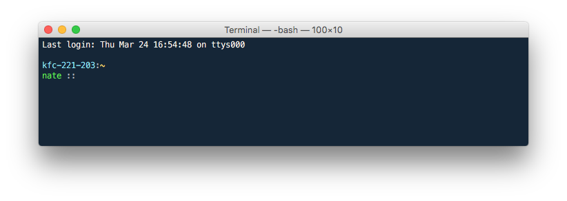

# bash

My personal configuration files and scripts for macOS.

## Instructions

Clone this repository to `~/bash` and add the following line to your `~/.bash_profile` or equivalent file:

    if [ -f ~/bash/init.sh ]; then
        source ~/bash/init.sh
    fi

## Extras

### Terminal Settings

To use my OS X Terminal app settings, go to the “Settings” tab in the preferences for the Terminal app, then import the `Nate.terminal` file (located in the “extras” folder).

### Git Configuration

To use my Git configuration, copy the `.gitconfig` file from the “extras” folder to `~/.gitconfig`. Be sure to edit the file and set the name and e-mail address. My current Git editor-of-choice is TextMate, so you will need to have TextMate installed (with the “mate” command).

#### Git Configuration Resources

- [Git - Git Configuration](http://git-scm.com/book/en/Customizing-Git-Git-Configuration)
- [Atlassian Git Tutorial - The git config Command](https://www.atlassian.com/git/tutorial/git-basics#!config)
- [GitHub Help - Using Textmate as your default editor](https://help.github.com/articles/using-textmate-as-your-default-editor)
- [TextMate Manual - Calling TextMate from Other Applications](http://manual.macromates.com/en/using_textmate_from_terminal.html)

## Credits

Portions of this code was taken from or inspired by the following:

- [fnando/bash](https://github.com/fnando/bash)
- [jonfaustman/.bashrc](https://github.com/jonfaustman/.bashrc)
- [Controlling the size of the $PWD in bash](http://www.debian-administration.org/article/548/Controlling_the_size_of_the_PWD_in_bash)
- [Show current virtualenv on bash prompt](http://engineerwithoutacause.com/show-current-virtualenv-on-bash-prompt.html)
